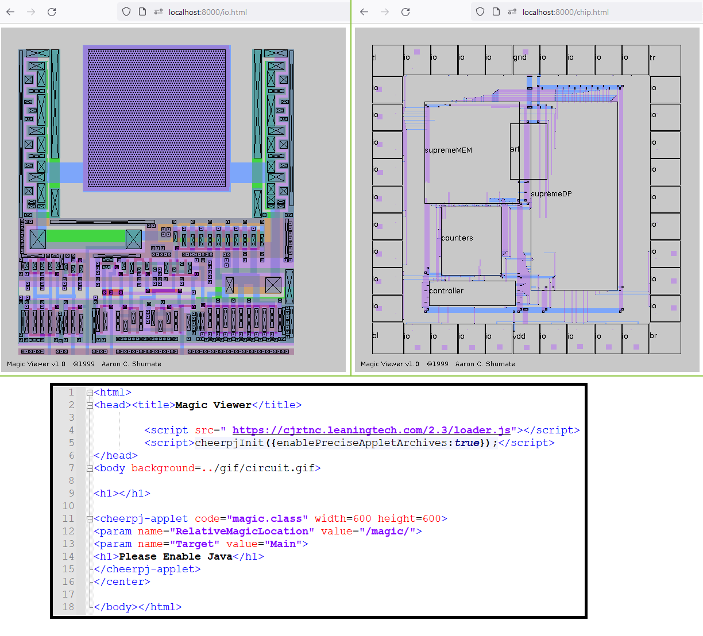
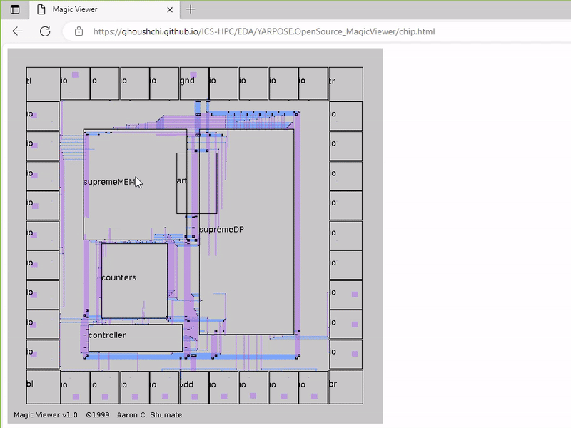

# Open Source Magic Viewer

Original code: (C) 1999-2023 [Aaron C. Shumate](https://www.linkedin.com/in/aaron-shumate/)

Migrated the original Java class files into platform-independent browsers via CheeprJ: (C) 
 [M. B. Ghaznavi-Ghoushchi](https://github.com/ghoushchi).

This is a simple one file only magic files viewer in browsers. This includes `.class` `.java` and a complete chip to render demo.

To see how the code runs go to the following link of a full chip click on each sub-block and see how it works in hierarchical order till reach the deepest level of a raw magic file.
 [https://ghoushchi.github.io/ICS-HPC/EDA/YARPOSE.OpenSource_MagicViewer/chip.html](https://ghoushchi.github.io/ICS-HPC/EDA/YARPOSE.OpenSource_MagicViewer/chip.html).

### Credits:
The original code is due to : (C) 1999-2023  [Aaron C. Shumate](https://www.linkedin.com/in/aaron-shumate/)
Migrated the original Java class files into platform-independent browsers via CheeprJ by (C) [M. B. Ghaznavi-Ghoushchi](https://github.com/ghoushchi).

# Related Projects
Please follow us to be informed about related projects:

<a href="https://github.com/yarpose" rel="nofollow noreferrer">
     YARPOSE - A Dejavu project in EDA
  </a> 
  <a href="https://www.linkedin.com/in/ghaznavi-ghoushchi" rel="nofollow noreferrer">
     M. B. Ghaznavi-Ghoushchi
  </a> &nbsp; 
  <a href="https://github.com/ghoushchi" rel="nofollow noreferrer">
     ghoushchi
  </a>

